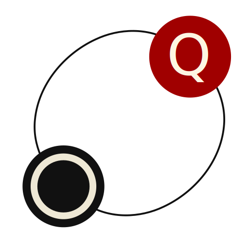

# Bio

::: {data-lang-en=true}

This is the webpage containing the exercises and homeworks for the course on
transducers at the University of Warsaw in 2024.

- **Course material**:
  <https://www.mimuw.edu.pl/~bojan/2023-2024/przeksztalcenia-automatowe-transducers>
- **Teacher**: [Mikołaj Bojańczyk](https://www.mimuw.edu.pl/~bojan/)
- **Teaching Assistant**: [Aliaume Lopez](https://www.irif.fr/~alopez/)

📡 Subscribe to the [RSS feed](./rss.xml) to get the latest updates.

:::

::: {data-lang-fr=true}

Ceci est la page web contenant les exercices et les devoirs pour
le cours sur les transducteurs à l'Université de Varsovie en 2024.

- **Supports de cours**: 
  <https://www.mimuw.edu.pl/~bojan/2023-2024/przeksztalcenia-automatowe-transducers>
- **Enseignant**: [Mikołaj Bojańczyk](https://www.mimuw.edu.pl/~bojan/)
- **Assistant d'enseignement**: [Aliaume Lopez](https://www.irif.fr/~alopez)

📡 Abonnez vous au [flux RSS](./rss.xml) pour être notifié des dernières mises à jour.

:::

::: {data-lang-pl=true}

To jest strona zawierająca zadania i prace domowe do kursu na temat transducerów
na Uniwersytecie Warszawskim w 2024 roku.

- **Materiały do lekcji**:
  <https://www.mimuw.edu.pl/~bojan/2023-2024/przeksztalcenia-automatowe-transducers>
- **Nauczyciel**: [Mikołaj Bojańczyk](https://www.mimuw.edu.pl/~bojan/)
- **Adjiunkt**: [Aliaume Lopez](https://www.irif.fr/~alopez/)

📡 Subskrybuj [kanał RSS](./rss.xml) aby otrzymywać najnowsze aktualizacje.

:::

# Portrait

{width=100%}

# Upcoming {#a-venir}Two-way automata with output

- [Two-way automata with output]{data-lang-en="Two-way automata with output"
                                data-lang-fr="Automates à deux sens avec sortie"
                                data-lang-pl="Automaty dwukierunkowe z wyjściem"}

# Welcome to the transducer course

Here are some of the notions that will be developed during the course

- Mealy Machines
- Unambiguous nondeterministic automata with output
- Mealy machines with regular lookahead
- Two-way automata with output
- The Krohn-Rhodes theorem and its variations
- Streaming stream transducers
- MSO transductions
- List manipulating functions
- Polyregular functions

# Exercise Sessions

1. [Mealy Machines](./session-1.html)
1. [Rational Functions](./session-2.html)

# Homeworks

To be announced.
